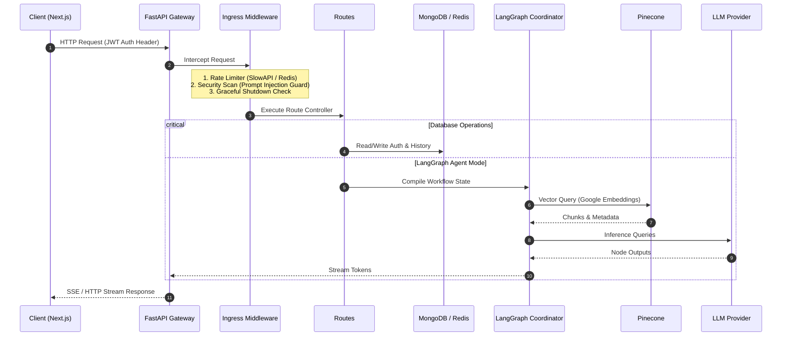
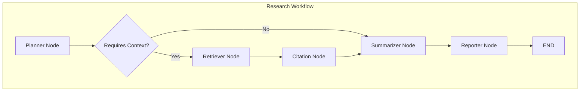
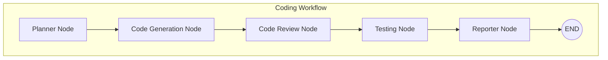
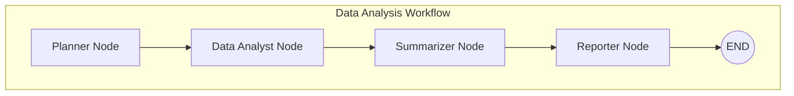
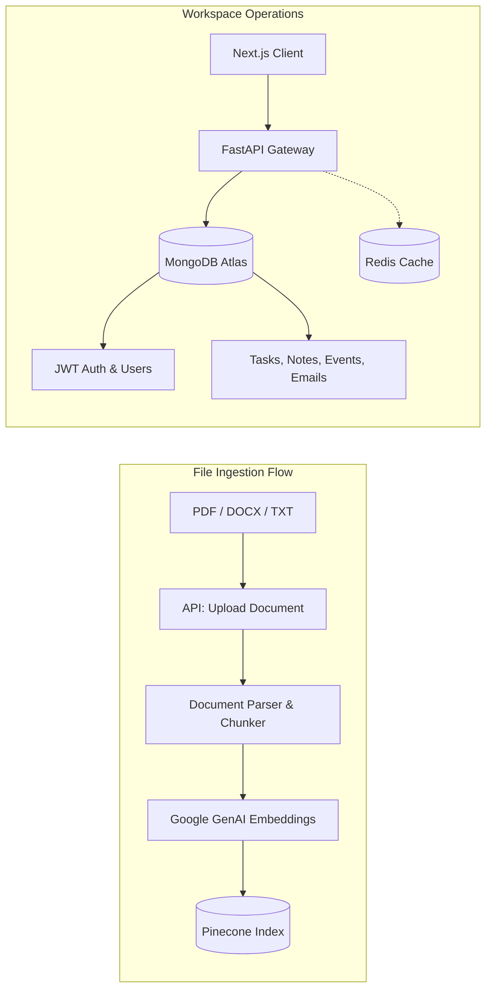

# TriVisionX AI System Architecture & Data Flow

This document provides a comprehensive end-to-end architectural map of the **TriVisionX Platform**, detailing the request pipelines, data models, multi-agent orchestration, and vector retrieval mechanics.

---

## 1. System Topology Overview

TriVisionX is built on a decoupled, production-grade Client-Server architecture utilizing:
- **Client Tier**: Next.js 15 (App Router, React 19, TailwindCSS, Framer Motion, Bun).
- **Application Gateway**: FastAPI (Python 3.11, Uvicorn, Asynchronous Lifespan, Pydantic v2).
- **Agent Orchestrator**: LangGraph (Multi-Agent StateGraph with cyclic and conditional routing).
- **Persistent Storage**: MongoDB Atlas (async Motor client) for sessions, tasks, notes, calendar events, and email inbox data.
- **Semantic Vector Index**: Pinecone DB storing document chunks and metadata references embedded via Google GenAI.
- **Cache Layer**: Redis Cache for API result caching.
- **Workflow Automation**: n8n workflows for offline, scheduled, and Slack-integrated tasks.

Below is the visual end-to-end architecture diagram:


---

## 2. Ingress Pipeline & Request Lifecycle

When a client initiates a request, it traverses several middleware layers before hitting the application logic.

### Ingress Flow



### Request Lifecycle Middleware
1. **Graceful Shutdown Middleware**: Tracks in-flight requests. When a termination signal (`SIGINT`/`SIGTERM`) is intercepted, it stops accepting new requests (returning `503 Service Unavailable`) and drains active connections (up to an 8-second timeout) before shutting down MongoDB/Redis clients.
2. **Rate Limiting**: Integrated via `slowapi` on endpoints (e.g., chat limits) to mitigate DDoS and token exploitation.
3. **Prompt Injection Guard**: Uses input scanning (`scan_text` and `sanitize`) to block malicious patterns.
4. **Compression Middleware**: Minimizes size of payload responses, excluding Server-Sent Events (`/api/chat/`) to prevent chunk buffering.
5. **CORS Middleware**: Safely configures client origins (Localhost, Vercel).

---

## 3. LangGraph Multi-Agent Orchestrator

The core reasoning logic of TriVisionX is orchestrated using **LangGraph**. The system runs on a shared, stateful memory representation (`AgentState`), coordinating a suite of specialized agents.

### Shared State Schema (`AgentState`)
Every node in the Graph modifies a subset of the shared dictionary:
- `query` / `conversation_id` / `user_id` / `filename`: Client-supplied metadata.
- `selected_llm_provider` / `selected_llm_model`: Runtime routing parameters.
- `requires_context` (bool): Indicates if the query requires external document RAG.
- `history` / `messages`: Conversation context and thread history.
- `retrieved_docs` (list): Ingested document chunks from Pinecone.
- `citations` (list): Evaluated document source nodes with deduplicated citations.
- `summary` / `generated_code` / `code_review` / `test_results` / `analysis_results`: Node-specific outputs.
- `final_output` (str): Assembled final markdown sent to the client.
- `terminate` (bool) / `errors` (list): Graph flow controllers.

---

## 4. Multi-Agent Workflows & State Diagrams

TriVisionX implements 6 core graphs loaded via a central factory:

````carousel

<!-- slide -->

<!-- slide -->

````

### Detailed Workflow Walkthroughs

### 1. Research Workflow
- **Planner Node**: Examines the user query and sets `requires_context` to `True` if references are needed.
- **Retriever Node**: Executes a Maximum Marginal Relevance (MMR) search in the Pinecone vector index using Google GenAI embeddings (`models/embedding-001`). This provides high diversity in the retrieved context chunks.
- **Citation Node**: Correlates retrieved chunks with original files, deduplicates source markers, and computes a relevance-to-query confidence score.
- **Summarizer Node**: Synthesizes the deduplicated source chunks into a coherent research response, keeping track of conversation history.
- **Reporter Node**: Formats the final text, appends verified citations, and structures the markdown blocks for client-side streaming.

### 2. Coding Workflow
- **Planner Node**: Dispatches the query directly to code workflows.
- **Code Generation Node**: Generates production-ready, typed implementations based on the query.
- **Code Review Node**: Reviews the code for algorithmic complexity, memory management, and anti-patterns.
- **Testing Node**: Drafts unit test blocks to guarantee coverage.
- **Reporter Node**: Packages code, review critiques, and unit tests into segmented markdown tabs.

### 3. Data Analysis Workflow
- **Planner Node**: Parses tabular dataset requirements.
- **Data Analyst Node**: Runs statistical calculations and parses data structures.
- **Summarizer Node**: Digests raw calculations into high-level summaries.
- **Reporter Node**: Assembles final statistical logs and charts.

---

## 5. Storage & Vector Retrieval Data Flow



### Ingestion & Vector Retrieval Data Flow
1. **Document Upload**: Users upload documents (`PDF`, `DOCX`, `TXT`) to `/api/documents/upload`.
2. **Chunking & Embedding**: Documents are chunked into structured windows, embedded via Google AI Studio's embedding models, and upserted to Pinecone.
3. **Retrieval**: During research agent sessions, queries are embedded and routed to Pinecone via MMR retrieval.
4. **Metadata Filtering**: Results are filtered using `user_id` and `filename` tags to isolate target research pools.

---

## 6. Offline n8n Automation Workflows

TriVisionX handles asynchronous, non-blocking integrations via an external n8n engine:
- **Slack Research Bot**: Polls workspace Slack channels, executes query pipelines against the FastAPI Gateway, and posts answers back as threads.
- **Scheduled Report Generator**: Automatically runs periodic research workflows (daily/weekly) and pushes summaries directly to the email client inbox.
- **Research Alert Pipeline**: Monitors external sources (RSS Feeds, news APIs), runs retrieval comparisons, and logs warnings for anomalous market indicators.

---

## 7. Development & Deployment Topology

### Container Structure
The codebase uses a multi-stage Docker build process:
- **Backend (Python 3.11-slim)**:
  - `builder` stage installs wheels and development libraries.
  - `runner` stage copies package runtimes and executes `index.py` using `uvicorn` under a non-root system user.
- **Frontend (Bun + Node)**:
  - Ingests source files using `bun install`.
  - Performs `next build` inside the builder.
  - Outputs a lightweight Next.js standalone folder run via Node.

### Hosting Blueprint
- **Frontend (Vercel)**: Configured as a Next.js 15 site. Interacts with the backend via `NEXT_PUBLIC_API_BASE_URL`.
- **Backend (Render)**: Set up as a Docker-backed Web Service. Scaled horizontally behind a load balancer with automated SSL and health checking at `/api/health`.
